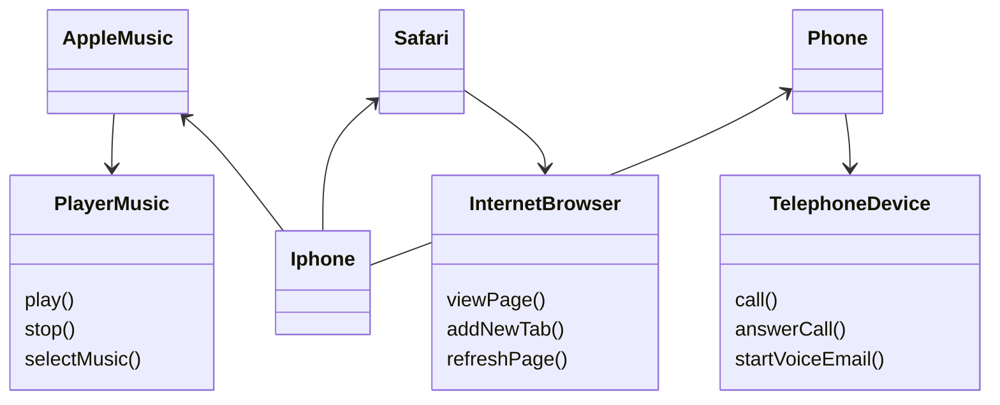

# Modelagem-Iphone

Um simples projeto de modelagem do iphone

### UML

```mermaid
classDiagram
AppleMusic --> PlayerMusic
Safari <-- Iphone
AppleMusic <-- Iphone
Phone <-- Iphone
Safari --> InternetBrowser
Phone --> TelephoneDevice
PlayerMusic : play()
PlayerMusic : stop()
PlayerMusic : selectMusic()
TelephoneDevice : call()
TelephoneDevice : answerCall()
TelephoneDevice : startVoiceEmail()
InternetBrowser : viewPage()
InternetBrowser : addNewTab()
InternetBrowser : refreshPage()
```
